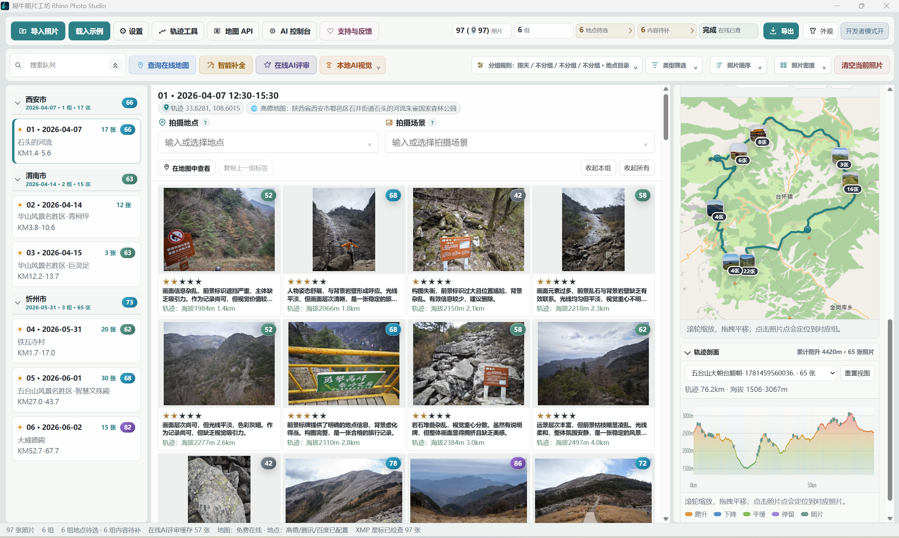
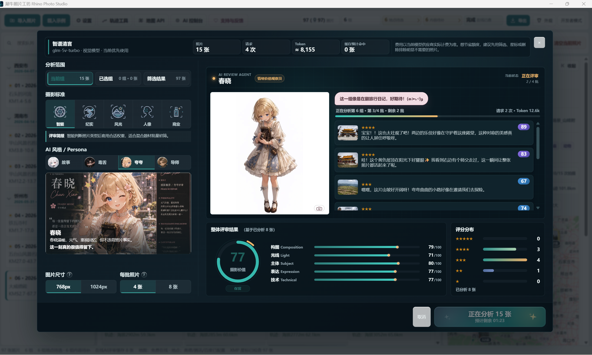
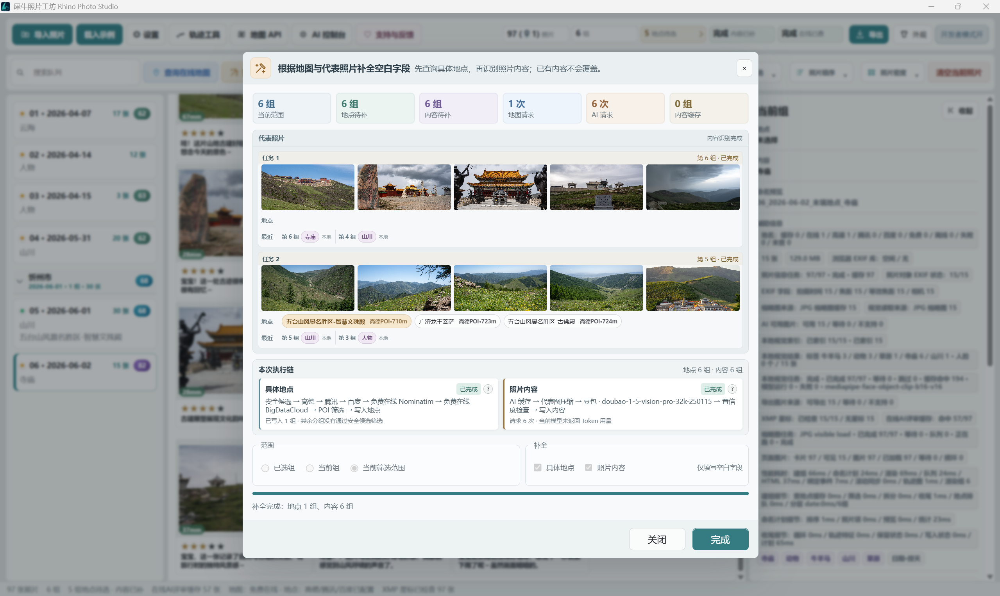

# 犀牛照片工坊 Rhino Photo Studio

一款面向摄影、户外、徒步和自驾旅行用户的本地照片管理工具。

## 下载

  

Windows 公开测试版已发布，安装包请从 Releases 页面下载：

https://github.com/shikistudio/RhinoPhoto/releases/latest

每一次拍摄回来，我们都会带回几百甚至几千张照片。真正困难的往往不是拍摄，而是整理：

- 哪些照片值得留下？
- 哪些照片适合分享？
- 哪些照片只是占用硬盘？
- 多年的旅行照片，如何重新找回线索？

犀牛照片工坊希望做一个更智能、更有陪伴感的照片工作流。它不会替你拍摄，也不会替你决定什么是美。它负责帮你发现，你负责做最后的判断。

## 下载

公开测试版准备中。正式安装包会发布在本仓库的 [Releases](https://github.com/shikistudio/RhinoPhoto/releases) 页面。

## AI 智能选片

接入 AI 视觉分析，对照片进行评分、筛选和解释，帮助你快速找到值得保存的作品。

它不是简单判断“好不好看”，而是结合：

- 构图
- 光影
- 清晰度
- 主体状态
- 情绪表达
- 旅行记录价值
- 个人收藏价值

从大量照片中，帮你找到真正重要的瞬间。

## 连接 Lightroom 工作流

对于摄影用户，AI 不应该替代你的判断。

犀牛照片工坊通过星标系统连接 Lightroom，让 AI 推荐结果可以继续进入你熟悉的摄影后期流程。

## 四季 AI 评审团

每一张照片，都可以获得不同视角的评价。

**春晓**  
夸夸模式，温暖陪伴，情绪价值拉满。她会认真发现照片里值得被喜欢的地方。

**夏晴**  
导师模式，像摄影老师一样指出问题和提升方向，帮助你下次拍得更好。

**秋野**  
毒舌模式，高傲摄影评论家，用更犀利的方式挑战你的审美。

**冬序**  
故事模式，注重照片背后的故事与情绪，读懂画面想表达的含义。

## 旅行轨迹与照片整理

结合 GPS、地图和拍摄信息，让照片不只是文件，而是一段完整旅程。

它可以帮助你：

- 根据路线整理照片
- 查看照片对应的地点与轨迹
- 将无坐标的相机照片匹配到旅行轨迹
- 导出可继续使用的轨迹与照片资料

## 为什么做这个项目

我自己也是一个喜欢旅行、户外和摄影的人。

我经历过拍下大量照片却没有时间整理，硬盘越来越满却不知道哪些照片值得保存，也经历过走过很远的路，却很难快速整理出属于那段旅程的记录。

所以我想做一个属于摄影爱好者的照片管理工具。

它希望帮助你在多年以后重新打开照片时，依然能找到那些值得回忆的瞬间。

## 支持开发

如果你觉得这个项目有价值，欢迎通过爱发电支持我继续开发。

赞助不会影响基础功能使用。你的支持会帮助我：

- 持续维护软件
- 改进 AI 能力
- 开发更多摄影工作流功能
- 完善四季 AI 评审团体系

感谢每一位愿意支持独立开发的人。

## 反馈

你可以通过本仓库的 [Issues](https://github.com/shikistudio/RhinoPhoto/issues) 提交问题、建议或使用反馈。

## 说明

本仓库用于发布 Rhino Photo Studio 的公开版本、更新日志与问题反馈，不包含源代码。
